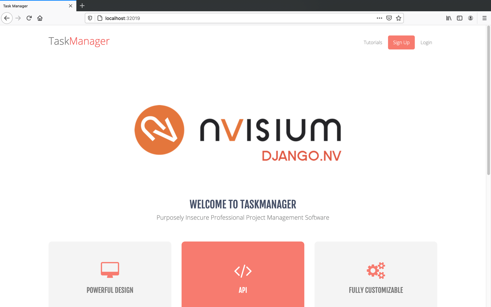

# Cloud One Admission Control Demo:

## Requirements:
- [Docker Desktop](https://www.docker.com/products/docker-desktop) Windows/Mac with K8s installed;
- Cloud One account with Container Security enabled;
- [Kubectl](https://kubernetes.io/docs/tasks/tools/install-kubectl/)

## How-To:

- Clone this GitHub repository
- Generate a [Cloud One Container Security API Key](https://cloudone.trendmicro.com/docs/container-security/get-started/#create-a-kubernetes-cluster) and change your API Key in the ```overrides.yaml```
- [Deploy the Admission Controller Pod](https://github.com/trendmicro/cloudone-admission-controller-helm):

```helm install trendmicro --values overrides.yaml https://github.com/trendmicro/cloudone-admission-controller-helm/archive/master.tar.gz```

- Create a policy to Block or Log the events:
     - Privileged Containers;
     - Containers with privilege escalation rights;

- Try to create the K8s deployment ```kubectl delete -f deployment.yml```

## Result:

You should be able to see Block/Log events in the console, you can play with both of the options or add more...

If you choose to log, you'll be able to access the Django app in the localhost:Nodeport, just execute ```kubectl get all``` to get the right port (In this case *32019*):

```
NAME                              READY   STATUS    RESTARTS   AGE
pod/django-app-6776b4d8f8-n9xgg   1/1     Running   0          50s

NAME                 TYPE        CLUSTER-IP    EXTERNAL-IP   PORT(S)          AGE
service/django-app   NodePort    10.97.66.99   <none>        8000:32019/TCP   50s
service/kubernetes   ClusterIP   10.96.0.1     <none>        443/TCP          21h

NAME                         READY   UP-TO-DATE   AVAILABLE   AGE
deployment.apps/django-app   1/1     1            1           50s

NAME                                    DESIRED   CURRENT   READY   AGE
replicaset.apps/django-app-6776b4d8f8   1         1         1       50s
````
The login for the application is:
```
user / user123
```



## Cleanup

To delete the Admission Control Pod just execute ```helm delete trendmicro``` to delete the K8s deployment just execute ```kubectl delete -f deployment.yaml```